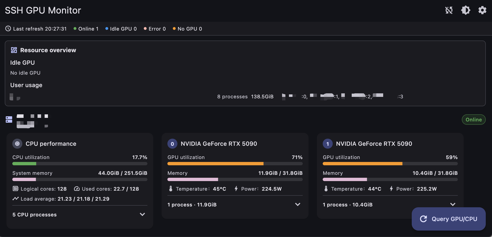

# GPU Monitor

[中文](README.md)

A small Flutter desktop app for querying GPU status across multiple machines over SSH.

## Features

- Reads host entries from `~/.ssh/config`.
- Runs `nvidia-smi` over SSH to query GPU utilization, memory, temperature, and power draw.
- Shows query results by host, with separate states for online, no GPU, error, and loading.
- Expands process details at the bottom of each GPU card, including PID, user, memory usage, elapsed time, and command line.
- Shows per-process SM / MEM utilization on supported Linux hosts; environments without `pmon` support degrade to `N/A`.
- Optional CPU monitoring can be enabled in Settings, showing CPU utilization, used cores, system memory, logical cores, and load by host.
- CPU cards expand to show the top CPU-consuming processes, including PID, user, CPU / MEM usage, memory, elapsed time, and command line.
- Aggregates idle GPUs by machine and GPU usage by user in the resource overview. CPU data is shown only inside each host section and is not added to the resource overview.
- Supports host selection, manual refresh, auto-refresh interval, light/dark themes, and language switching between English and Chinese.
- Supports per-host availability alerts that send a Windows/macOS system notification after two matching samples confirm a server-wide busy-to-idle or idle-to-busy transition.
- Optionally keeps running after the window is closed: Windows hides the app in the system tray, while macOS keeps it in the Dock, without interrupting monitoring or alerts.

## Availability alerts

Use Send test system notification in Settings to verify Windows/macOS notifications and permissions, then enable alerts for the hosts you want to watch. Enabling an alert also enables auto refresh.

Alerts work only while the app is running, the computer is awake, network and SSH access are available, and auto refresh is enabled. The first successful query establishes a baseline without sending a notification. Once a change is confirmed, a system notification is delivered. A server is considered idle when at least one GPU satisfies the existing idle rule.

To keep receiving alerts after closing the main window, enable **Settings → Desktop behavior → Keep running when the window is closed**. On Windows, click the tray icon to restore the window or right-click it and select **Quit GPU Monitor** to exit. On macOS, click the Dock icon to restore the window and use the application menu to quit.

Building the Windows app from source requires the optional **C++ ATL for the latest v143 build tools (x86 & x64)** component in Visual Studio Build Tools for system notifications. Users of an already-built app do not need to install it.
