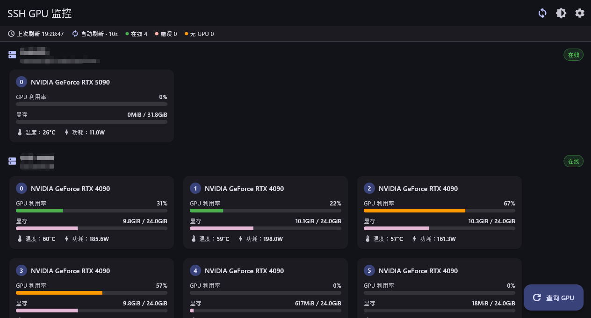

# GPU Monitor

一个用于通过 SSH 查询多台机器 GPU 状态的 Flutter 桌面小工具。



## 功能

- 从 `~/.ssh/config` 读取主机配置。
- 通过 SSH 执行 `nvidia-smi`，查询 GPU 利用率、显存、温度和功耗。
- 按主机展示查询结果，并区分正常、无 GPU、错误和加载状态。
- 支持选择启用的主机、手动刷新、自动刷新间隔和浅色/深色主题。

## 构建与运行

先确认已安装 Flutter，并启用 Windows 桌面支持：

```powershell
flutter config --enable-windows-desktop
flutter doctor
```

获取依赖并运行测试：

```powershell
flutter pub get
flutter test
```

本地调试运行：

```powershell
flutter run -d windows
```

构建 Windows 可执行文件：

```powershell
flutter build windows
```

构建产物位于：

```text
build/windows/x64/runner/Release/gpu_monitor.exe
```
