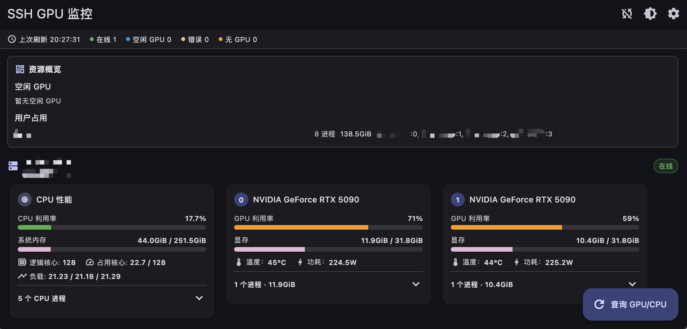

# GPU Monitor

[English](README.en.md)

一个用于通过 SSH 查询多台机器 GPU 状态的 Flutter 桌面小工具。

## 功能

- 从 `~/.ssh/config` 读取主机配置。
- 通过 SSH 执行 `nvidia-smi`，查询 GPU 利用率、显存、温度和功耗。
- 按主机展示查询结果，并区分正常、无 GPU、错误和加载状态。
- 在每张 GPU 卡片底部折叠展示进程详情，包括 PID、用户、显存占用、运行时间和命令行。
- 在支持的 Linux 主机上展示进程级 SM / MEM 利用率；不支持 `pmon` 的环境会自动降级为 `N/A`。
- 在资源概览中按机器聚合展示空闲 GPU，并按用户聚合展示 GPU 占用。
- 支持选择启用的主机、手动刷新、自动刷新间隔、浅色/深色主题和语言中英文切换。